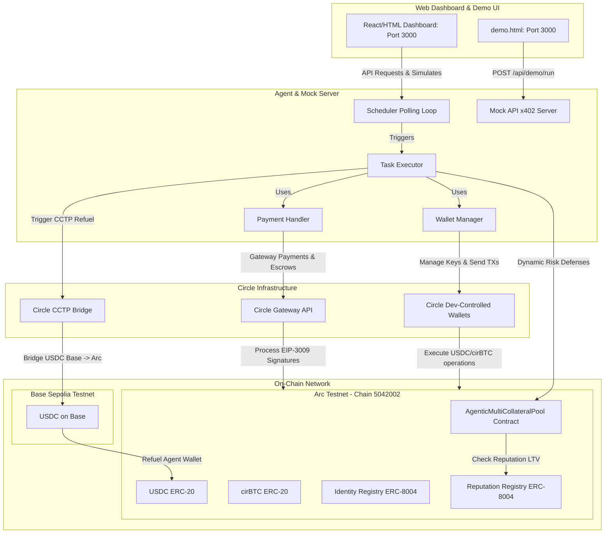

# Project Submission: Arc Agentic Commerce & Lending Bot

This document details the project submission for the **Stablecoin Commerce Stack Challenge** under the **Best Agentic Economy Experience on Arc** track.

---

## 1. Project Overview

### Project Title
**Arc Agentic Commerce & Lending Bot** (or *Arc Worker Bot*)

### Track
**Best Agentic Economy Experience on Arc**

### Developer Email (Circle Dev Account)
`zitterhieu@gmail.com`

### GitHub Repository
[arc-agentic-lending-bot](https://github.com/wangminhei/arc-agentic-lending-bot)

### Live Demo URL
[http://116.118.45.130:3000](http://116.118.45.130:3000) (Dashboard)
[http://116.118.45.130:3000/demo.html](http://116.118.45.130:3000/demo.html) (Gas-Free Payments Demo)

---

## 2. Short Description
An autonomous AI Agent bot executing on-chain tasks on **Arc Testnet** that features reputation-based lending (ERC-8004/LTV upgrade), dynamic risk governance (automatic deleveraging or cross-chain refuels via **Circle CCTP**), and high-frequency, gas-free payments utilizing **Circle Gateway (EIP-3009/x402)** for agentic economy workloads.

---

## 3. Circle Products Integrated on Arc
*   **USDC:** Primary stablecoin rail for collateral, debt representation, and gasless payments on Arc.
*   **Circle Developer-Controlled Wallets:** Programmatic and secure key management enabling the AI Agent to execute autonomous transactions without manual human signing.
*   **Circle Gateway:** Infrastructure for processing premium agentic resource access, routing pay-per-inference and pay-per-dataset queries.
*   **Circle CCTP & Bridge Kit:** Automated cross-chain liquidity refuels (Base Sepolia -> Arc Testnet) to rescue collateralized lending positions from liquidation.
*   **Unified Balance Kit:** Integrated to query consolidated USDC balances across Arc Testnet and Base Sepolia networks.
*   **Nanopayments (x402-batching):** EIP-3009-based gas-free payment signatures enabling micro-transactions for pay-per-inference computations.

---

## 4. System Architecture Diagram

---

## 5. Functional MVP Walkthrough

Our solution showcases how an AI Agent participates in the agentic economy using stablecoin payment rails:

1.  **AI Agent Identity & Reputation (ERC-8004)**: The agent registers its on-chain identity and records task performance. High reputation scores dynamically increase its borrowing capacity (LTV) on the lending contract from 80% to **90% LTV**.
2.  **Autonomous Risk Governance**: The agent manages a collateralized position (USDC + cirBTC) and borrows EURC. If the Health Factor drops below `1.20` (simulated market crash), the agent defends the position using 3 layers of defense:
    *   **Layer 1 (Auto-Deposit)**: Deposits surplus USDC from its local wallet.
    *   **Layer 2 (Emergency Deleverage)**: Automatically sells cirBTC collateral directly on-chain using Oracle prices to repay n debts.
    *   **Layer 3 (Circle CCTP Bridge)**: If the local wallet has no USDC and no cirBTC remains, it triggers Circle CCTP to bridge USDC from Base Sepolia to Arc Testnet to rescue the position.
3.  **High-Frequency Gas-Free Payments (demo.html)**: The demo page allows anyone to request 20 high-frequency automated payouts. The server processes payments using Circle Developer-Controlled Wallets, with transactions spaced at 1.5s intervals to satisfy rate limits, resulting in rapid, gas-free transfers verified on ArcScan.
4.  **Unified Balance Kit Integration (scripts/demo-unified-balance.ts)**: We integrated Circle's newly released Unified Balance Kit using the Developer-Controlled Wallets Adapter to easily query consolidated and per-chain balances.

---

## 6. Circle Product Feedback

### 1. Why we chose these products
*   **USDC on Arc:** Arc's model utilizes USDC as the native gas token. By using USDC, we created a single stable asset loop for transaction fees, collateral, and payouts, removing all cryptocurrency price volatility from the agent's operations.
*   **Developer-Controlled Wallets:** Vital for automation. We needed a secure way to programmatically sign transactions (transfers, deposits, borrows) without storing plaintext private keys on public servers or requiring human manual approvals.
*   **Circle Gateway (x402):** Enabled gas-free, micro-payment signatures based on EIP-3009. This is the optimal architecture for pay-per-inference workloads where agents pay tiny amounts for data/computation streams.
*   **Circle CCTP:** Crucial for bridging liquidity across chains to execute cross-chain risk mitigation strategies without relying on complex, unaligned third-party wrappers.

### 2. What worked well during development
*   The **Circle Gateway API** handles batched EIP-3009 signature verification cleanly.
*   **Developer-Controlled Wallets API** is comprehensive, providing well-structured endpoints for wallet creation, transaction signing, and tracking.
*   **CCTP** is robust and abstracting the bridging complexity into standard on-chain contracts simplifies the cross-chain treasury movement significantly.
*   **Unified Balance Kit** makes multi-chain balance queries extremely clean by abstracting the need to query multiple chain RPCs manually.

### 3. What could be improved & Developer Recommendations
*   **Clock Skew / validity_too_short Enforcement:** We encountered frequent `authorization_validity_too_short` errors when validating EIP-3009 signatures on Circle Sandbox. The gateway enforces that the `validBefore` timestamp must be at least ~4 days in the future relative to the gateway server time. If the local system clock has even a minor drift (clock skew), or if the default timeout configuration isn't broad enough, the signature is rejected. 
    *   *Recommendation:* Circle SDK should document this 4-day threshold clearly. The client SDK could also automatically pad `validBefore` with a larger default buffer (e.g. 30 days) to prevent transient clock-drift failures.
*   **Dual-Package Bundle Hazard (ESM vs CJS):** The `@circle-fin/x402-batching` library bundles both ESM (`.mjs`) and CommonJS (`.js`) packages. In Node.js environment running transpilers like `tsx` or `ts-node`, runtime prototype patching of `BatchEvmScheme.prototype` on the CommonJS side does not propagate to the `GatewayClient` if it internally references the ESM bundle.
    *   *Recommendation:* Align internal exports to avoid duplicate memory instances or provide official hooks/middlewares to override transaction timeout parameters easily during initialization.
*   **Rate-Limiting Documentation for Sandbox:** For sandbox environments, the Sandbox API is prone to rate-limiting (`429 Too Many Requests`) when executing consecutive payments.
    *   *Recommendation:* Official developer docs should include guidance on recommended throttle/spacing parameters (e.g., minimum 1.5s delay) to help builders design reliable queue handlers.
